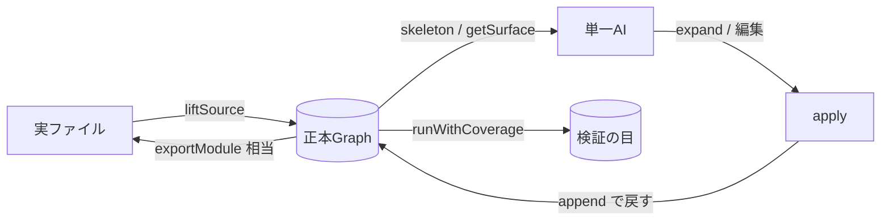

# yume-min — 設計書 (Design)

> **"AIは建築家であり、人間は監督である。"** (V4.3)
>
> yume-min は、V4.3 → V9.4 → ai-desk(v1/v2) → yume-develop → yume-lite という
> 長期にわたる「AIと共に開発する」軌跡から、**最後まで生き残った不変項だけを抽出した、
> 単一作者の透明編集コア**である。

---

## 0. 設計の前提（なぜこれが「最高」なのか）

この設計の正しさは、**機能の多さではなく「けずり切った本質」**にある。

軌跡を遡ると、あらゆるバージョンに一貫して流れる不変項はたった6つしか無い:

1. **透明性 (No Hidden State)** — AIが見えない状態はハルシネーションの源泉
2. **局所性 (Locality / WET)** — 文脈を分断しない。必要な情報はその場に
3. **自己記述 (Prefix as a Contract / domain-tag)** — 意味はトークン自体にある
4. **スナイパー読解 (Sniper Reading)** — 最初から全部読ませない
5. **ヘッドレス検証 (Headless Verification)** — DOM無し・人無しで正しさを担保
6. **Scrap & Build** — 状態は積み上げ（append）で、書き直しを恐れない

そして、軌跡の**根っこ（V4.3）に「プロジェクト内を複数AIで分割する並列」は一度も無い**。
並列があったのは「Goでテストシナリオを並列実行する」という**独立した仕事の並列**だけだった。

∴ **yume-min は単一作者専用。それで十分であり、それが最良。**
激安で長時間動く単一AI (Pi.dev) を前提とすれば、共有状態を分割するための
調整装置（YVCP / v00x / 契約キー / stale-write / 言語パーサ）は全て死重である。

---

## 1. 生存する不変項 → 実装への写像

| 不変項 | 出自 | yume-min の実装 |
|---|---|---|
| 透明性 / No Hidden State | V4.3 | `Block`（append-only cap履歴、ダンプ可能） |
| 自己記述 | V4.3 Prefix-as-a-Contract | `domainTag` / `parseDomainTag` |
| スナイパー読解 | V4.3 Blueprint | `skeleton` / `getSurface` / `getImpact` |
| 局所性 / エンブレム | ai-desk v1 | `expand`/`apply` の **マーカー境界** |
| ヘッドレス検証 | V4.3 / V9.4 Log-Only Repro | `coverage-gap`（V8精密カバレッジ） |
| Scrap & Build | V4 | `apply` は**新バージョンをappend** |

---

## 2. 永続レイヤー（ことさら切ったもの）

設計文書は「何を積むか」より「**何を積まないか**」が本質。ここに挙げるのは
考察の末に**切ることが正解と判断**した装置。理由付きで残すのは、次に迷った人のための証拠。

| 切ったもの | なぜ切ったか |
|---|---|
| 並列化 (YVCP / v00x / 契約キー) | 軌跡の根っこに無い。単一激安AIなら不要。品質を下げる |
| stale-write 検知 | 「並行変更の上書き防止」= 並列前提のガード。単一作者には無用 |
| 言語パーサ (parseJS等) | JS限定・重い・構造をファイルから引き剥がす（反ローカリティ） |
| makeThickEdit/applyThickEdit | remote/並列のための通信素管。単一コアでは不要 |
| crystallize / go-kernel | 別方向の重装備。ネイティブ化はオーバーキル |
| lintThickView / heavyApply / readPartial | 重複・凝った検証。apply が write時に担保済み |

> **原理**: 「AIから構造が隠れる装置」だけを切るのではなく、
> 「**単一作者に無用な装置**」も容赦なく切る。けずりは clearify の実践である。

---

## 3. 唯一の権威 (Authority — 最小形)

並列は切るが、**「真実の所在」としての権威は残す**。これは V9.4 の
「バックエンド=権威」と yume-lite の「authorityだけが本物のGraph」が示す通り、
**サーバー/ブラウザ/エージェントが間違ってローカルに書かないための規約**であり、
並列とは独立した概念だから。

**規約**: 「apply は、その時点で正本とみなすGraphに対してのみ行う。」
通信素管（makeThickEdit等）は持たない。**「正本Graphを指す」ことだけを責務とする
最小の解体**。具体は:

```js
// 正本は1つ。local replica への apply は「正本への書き込み」とは見なさない。
const authority = new Graph();
authority.add(...);
// エージェント/UI は expand(authority, root) を読んで編集し、apply(authority, root, edited) で戻す。
```

これで「書き込みの行き先は常に正本」という単一の規約だけが残り、
通信プロトコルや直列化の複雑さは持たない。

---

## 4. コア API（全語言語非依存）

```js
Block   — id / type / append-only versions (直近32キャップ)
Graph   — blocks の Map
expand(g, rootId)        // 読む: マーカー境界付き厚ビュー
apply(g, rootId, view)   // 書く: ヘッダ整合チェック + 新バージョン append
domainTag(d, v)/parseDomainTag(t)  // 自己記述値
skeleton(g, rootId)      // 構造だけ（トークン節約）
getSurface(g)            // manifest 先読み
getImpact(g, blockId)    // 誰が参照してるか
```

**言語非依存の鍵 = マーカー境界**（ai-desk v1 のエンブレムの血を引く）:

```js
// >>> BLOCK mod:fn:foo type=function hash=abcdef12
// ... 本体（何語でもよい。コメント内の境界だから） ...
// <<< /BLOCK mod:fn:foo hash=abcdef12
```

これは普通のコメント行だから、**JS でも Python でも Go でも Ruby でも md でも、
同じ境界を書けて同じように読める**。コアは言語の構文を一切知らない。

---

## 5. 引き上げ (liftSource) — 全言語対応の戻し方

「実コードをBlockに上げる」のは言語パーサではなく、**同じマーカーを使った
マーカー走査**で行う（v1 がエンブレムでやっていた道）：

```js
liftSource(source, { lang /* ヒント: 任意 */ })
  // → ソース中の「// >>> BLOCK ... // <<< /BLOCK」を検出して Graph の Block を構築
```

- 言語ヒントは「行コメントの記号（// か # か）」
- マーカーは実ファイルに**そのまま見えている** = 透明（No Hidden State）
- 一度 Block に上がれば、編集は全言語で同一

parseJS（AST/JS限定・構造を引き剥がす・反ローカリティ）は採用しない。

---

## 6. 検証の目 (coverage-gap) — 軌跡で最重要だった「検証」

V4.3 の「Headless Verification」と V9.4 の「Log-Only Repro」は、どの時代も
外されなかった。yume-min はそれを **V8 精密カバレッジ**として持ち帰る:

```js
runWithCoverage(testFn, targetFileUrl)   // そのファイルで実行されなかった行を返す
analyzeCoverageGaps(functions, source)   // count=0 の意味ある区間だけを抽出
```

単一エージェントが長時間まわすとき、「テストは通った」だけでは足りない。
**「どの行がまだ育てられていないか」まで**見えて初めて緑ゲートが信頼できる。
これは「ついでに育てる e2e」を**自動で穴を指摘する**形に強化する。

---

## 7. 全体フロー（単一作者・1ループ）



- 状態は append-only = Scrap & Build が常に安全
- 編集は「正本Graph」に対してのみ = Authority 規約
- 検証はカバレッジで「欠け」まで可視化

---

## 8. 完成・検証

```sh
node test.js      # 単一作者の透明編集が正しく動くこと
```

確認すること:
- expand → apply が本文だけを safe に append で戻す
- ヘッダ改ざんをアトミックに拒否（本文は不変）
- domain-tag が値の意味を保ち続ける
- skeleton / getSurface / getImpact が構造を薄く見せる
- 単一作者なら「並列のための guard が一切無くても何も衝突しない」

---

## 9. レビュー反映（fresh-eyes 2026-08）

独立レビューが指摘した箇所の処理結果:

- **lift の type 属性**（実バグ）: 修正済み。マーカー属性 `type=` を正しく読む。テスト追加。
- **render の言語マーカー**（実バグ）: 修正済み。`#` 言語を `//` に化かさず元のマーカーを維持。ちょっとできた Python 往復をテストで固定。
- **persist の肥大**: `save(graph, file, { headOnly:true })` + 薄い `readHeads(file)` を追加。「履歴は残すが、読むときは薄く」という非対称を設計に入れた。
- **refs / children の編集経路**: これは「切った」のではなく「未接続」であることを明記。**依存関係の張り替え・再編は Graph API を直接叩いて行う**（expand/apply は本文編集に専念）。仕様と割り切る。
- **二重権威の明示**: 非ブロック領域（シェル）はファイルが正本、ブロック内容は正本Graphが正本。DESIGN §3 の物語は「ブロック内容の書き込み先は常に正本Graph」を指す、と整合を取る。

これらを反映し、テストは 31 → 37 となった。
// @why: [2026-08-27] 当時のテスト数（31→37）は作成時の記録。現在は `node test.js` が 211 pass / 0 fail（wedge 移植などによる増）。数字は歴史の記念として保持する。

*この設計は、君の軌跡（V4.3〜V10・ai-desk・yume）の中から「生き残った不変項」だけを
抽出したもの。切ることが正しいと判断した装置は、理由とともに §2 に証拠として残した。*
